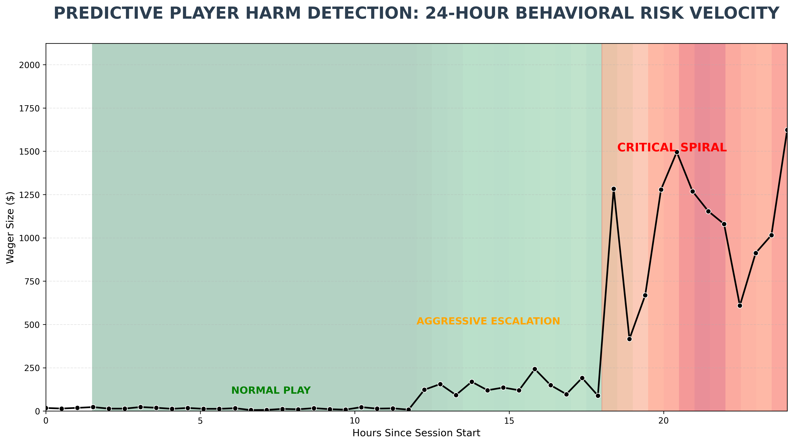

# Predictive Player Harm Detection: Behavioral Risk Analytics

## Project Overview
This repository contains a specialized forensic tool designed for the **iGaming and Fintech sectors**. The engine monitors player betting behavior over 24-hour windows to identify "Markers of Harm" (MoH). Specifically, it detects **Pathological Loss-Chasing**, where a player’s wager velocity and size escalate into a critical risk state.

##  Strategic Value
For global operators like **Flutter Entertainment**, proactive player protection is a regulatory and ethical priority. This tool provides:
* **Logarithmic Behavioral Scaling:** Ensures that low-stakes activity ($10–$20) remains visible even when high-stakes "spikes" ($1,000+) occur.
* **Risk Velocity Mapping:** Identifies the speed at which a player transitions from baseline play to aggressive escalation.
* **Intervention Triggers:** Clearly defines the "Critical Spiral" zone where platform intervention (cooling-off periods) is required.

##  Technical Implementation
The system is built on **Time-Series Analysis** and **Predictive Visualization**. 

**When i run** the core engine, it executes the following:
* **Data Ingestion:** Simulates or ingests raw transactional logs.
* **Volatility Calculation:** Uses rolling standard deviation and mean velocity to score risk levels.
* **Log-Scale Rendering:** Generates a high-resolution forensic dashboard that maps wagers against a risk-velocity heatmap.

## Repository Structure
* `main.py`: The core behavioral analytics engine.
* `requirements.txt`: Environment dependencies.
* `guardian_player.png`: Sample output of the forensic dashboard.
* `LICENSE`: MIT Licensed for professional transparency.
